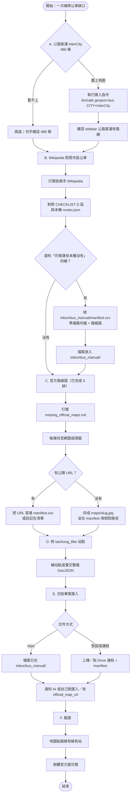

# 公車資料一次補齊：步驟與流程

目標：把目前所有缺口一次處理完。  
相關檔案目錄：[`docs/bus_data_gaps/`](./)　手動交件匣：[`inbox/bus_manual/`](../../inbox/bus_manual/)

---

## 總覽流程圖



---

## 階段 A — 公路客運（約 30–90 分鐘，電腦跑）

**這批不是缺資料，是還沒匯入。不要手畫。**

1. 公路客運已於 2026-08-27 全數匯入（486 檔）。若 TDX 有新增路線，再跑：
2. 在專案根目錄執行：

```bash
bin/rails geojson:bus CITY=InterCity
```

3. 完成後應出現大量 `public/geojson/bus/inter_city_*.geojson`，且 `routes.json` 的 `bus` 會含 `city_id: InterCity`。
4. 開地圖 → 公車 → **公路客運**，抽查幾條（如 1820、9001）有線有站。

若不做公路客運，直接跳到 B，但 checklist 的 A 就留白。

---

## 階段 B — Wikipedia 對照「TDX 沒有的市區線」（你人工判斷）

對照表：[`CHECKLIST.md`](CHECKLIST.md) 的 **D 區**。

1. 依序打開 Wikipedia（至少這幾頁）：
   - [苗栗縣公車](https://zh.wikipedia.org/wiki/苗栗縣公車)
   - [臺東縣公車](https://zh.wikipedia.org/wiki/臺東縣公車)
   - [花蓮縣公車](https://zh.wikipedia.org/wiki/花蓮縣公車)
   - 其餘偏少縣市：雲林、嘉義市、南投、彰化、澎湖、新竹市（見 CHECKLIST D4）
2. 對每一條 Wikipedia 路線問自己：
   - 現在還在跑嗎？
   - 本機已有嗎？（看 CHECKLIST 或地圖）
   - 若本機沒有 → **要補**（通常 TDX 也沒獨立 shape）。
3. 苗栗特別注意：
   - 市區：`101` 已有；`101A` / `101B` / `101C` 若仍營運 → 手補。
   - 其餘大量「苗栗－某某」多半是**公路客運**，應在階段 A，不要當縣公車重畫。
4. 台東：市區 101/201/202/203 大致齊；**蘭嶼公車**若要上圖 → 整包手補。
5. 花蓮：主線 301–311 有；Wikipedia 的 `302A`、`305A`、`308A`、`311A` 等變體若仍營運 → 手補。
6. 把要補的線全部寫進 [`inbox/bus_manual/manifest.csv`](../../inbox/bus_manual/manifest.csv)：

```csv
city_id,ref,name,slug,geometry_file,map_file_or_url,operator,source_note,wikipedia_ref
MiaoliCounty,101A,101A 竹南科－高鐵站,miaoli_county_101a,miaoli_county_101a.geojson,maps/miaoli_county_101a.jpg,金牌客運,仍營運,https://zh.wikipedia.org/wiki/苗栗縣公車
```

7. 為每一列準備：
   - **路線檔**：`inbox/bus_manual/{city_id 或扁平}/{slug}.geojson`（格式見 [`HOW_TO_SUPPLY.md`](HOW_TO_SUPPLY.md)）
   - **路線圖**：公開 URL，或 `inbox/bus_manual/maps/{slug}.jpg|png|pdf`

沒有要補的變體 → `manifest.csv` 只留表頭，進階段 C。

---

## 階段 C — 官方路線圖（已完成）

桃園 31 條已寫入 `official_map_url`（ebus `…/cms/api/route/{id}/map/latest`）。  
[`missing_official_maps.md`](missing_official_maps.md) 目前 **Total: 0**。

若之後又出現缺圖：

1. 從名單抄 `slug`，找官網圖或掃圖。
2. 寫進 `manifest.csv` 的 `map_file_or_url`，或在 `missing_official_maps.md` 用 `<- https://…` 註解後跑 `bin/rails geojson:bus_manual_import`。
3. 找不到圖：`source_note` 填 `no_map_found`。

連江縣公車無官方路線圖，本專案不收錄。非固定專車不收錄。
---

## 階段 D — 修薄幾何（1 條）

| slug | 要做的事 |
| --- | --- |
| `taichung_86e` | 補齊站點（至少去／回合理站序），或交一版完整 GeoJSON |

可覆寫現有 `public/geojson/bus/taichung_86e.geojson`，或放到 inbox 後請匯入覆蓋。

---

## 階段 E — 一次交件

資料夾結構建議：

```text
inbox/bus_manual/
  README.md
  manifest.csv          ← 必填，涵蓋 B+C+D 全部列
  maps/
    {slug}.jpg
    …
  MiaoliCounty/         ← 可選子目錄，或扁平放根目錄
    miaoli_county_101a.geojson
  …
```

然後任選：

- 直接 commit／留在 working tree，跟我說「inbox 已放好，請匯入」；或  
- 對話上傳 zip／貼雲端連結。

我會（或你自己）依 `manifest.csv`：寫入／更新 GeoJSON、`official_map_url`、重跑 `geojson:routes_manifest`。

---

## 階段 F — 驗證清單（打勾）

- [ ] 公路客運（若有做 A）：抽查 ≥3 條有線有站  
- [ ] Wikipedia 新增線：每條在地圖上找得到，站點 ≥2  
- [x] 官方圖：缺圖數已為 0（桃園 31 已補）；抽查側欄圖能開  
- [ ] `taichung_86e` 站點不再只有 1 個  
- [x] `bin/rails geojson:bus_gaps_export` 後缺官方圖為 0

---

## 你需要打開的檔案（一次備齊）

| 用途 | 路徑 |
| --- | --- |
| 本流程 | [`docs/bus_data_gaps/WORKFLOW.md`](WORKFLOW.md)（本檔） |
| 待辦總表 | [`CHECKLIST.md`](CHECKLIST.md) |
| 交件規格 | [`HOW_TO_SUPPLY.md`](HOW_TO_SUPPLY.md) |
| 缺圖名單（應為空） | [`missing_official_maps.md`](missing_official_maps.md) |
| 公路客運編號（已匯入則為空） | [`intercity_not_imported_refs.txt`](intercity_not_imported_refs.txt) |
| 交件匣 | [`inbox/bus_manual/`](../../inbox/bus_manual/) |

---

## 時間感（粗估）

| 階段 | 粗估 |
| --- | --- |
| A 匯入 InterCity | 已完成（486 檔） |
| B Wikipedia＋蒐集缺線 | 視缺幾條；幾何描線最耗時 |
| C 官方圖 | 已完成（桃園 31） |
| D 修 86E | 十幾分鐘 |
| E–F 交件驗證 | 半小時 |

建議一次做完的順序就是圖上的 **A → B → C → D → E → F**，不要先手畫 InterCity。
